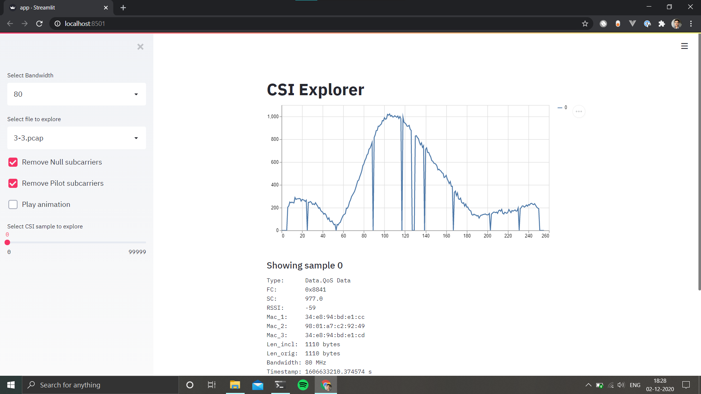
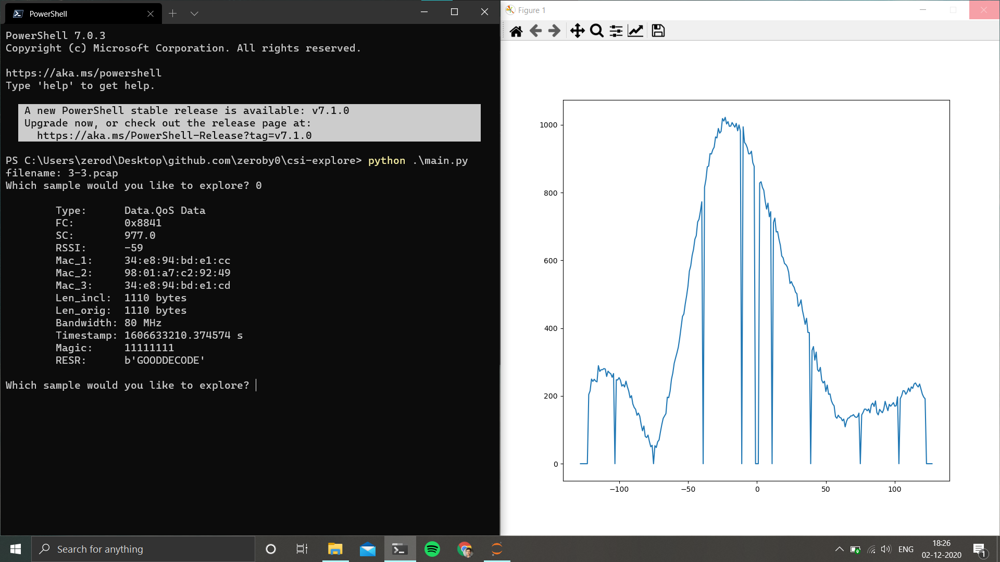

# Deprecated

CSI Explorer is deprecated.

I made a new version, https://github.com/nexmonster/nexmon_csi/tree/feature/python/utils/python which is faster, and works with the 5.4.51 branch.

# CSI Explorer

This is an app to explore CSI samples collected via Nexmon_CSI.
Currently it works only with my [pi-5.4.51-plus](https://github.com/zeroby0/nexmon_csi/tree/pi-5.4.51-plus) or [pi-4.19.97-plus](https://github.com/zeroby0/nexmon_csi/tree/pi-4.19.97-plus) branches.
I'm planning to add support for the default Nexmon_csi pcap files and other devices in the near future.

There are two ways you can explore CSI samples with: Terminal and Browser. You will need to install [streamlit](https://www.streamlit.io/) to use the browser version. The plot is redrawn on the same matplotlib window to keep it convinient.

#### Browser

#### Terminal

## Installation and Usage
- `pip install numpy matplotlib` for Terminal.
- `pip install numpy streamlit` for Browser.

Add your PCAP files to the `files` folder.

- `python main.py` to run the Terminal explorer.
- `streamlit run app.py` to run in the Broswer.

